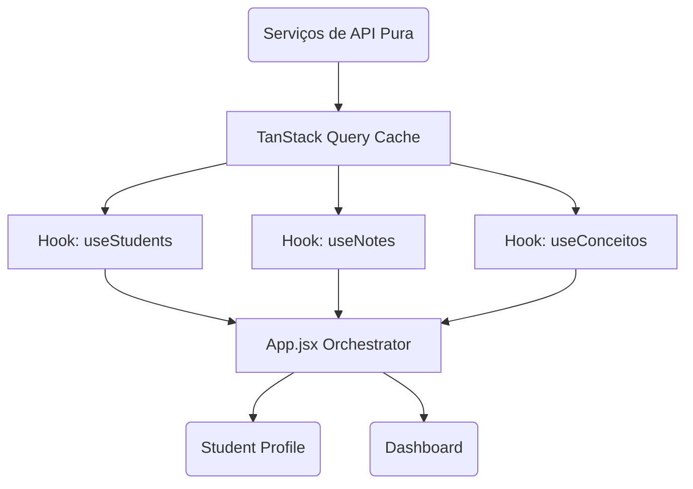

<div align="center">
  
  
  # 📊 TutorDash

  **O seu assistente definitivo para análise de desempenho escolar e turmas.**
  
  <p align="center">
    
    
    
    
  </p>
</div>

---

Bem-vindo ao **TutorDash**! Este documento está dividido em duas partes para atender melhor às suas necessidades: se você é um **Educador/Gestor** que deseja usar a ferramenta, ou um **Desenvolvedor** que fará manutenções no sistema.

<details open>
<summary><b>📑 Sumário</b></summary>
<br>

1. [👩‍🏫 Seção 1: Para Educadores e Gestores](#educadores)
   - [Recursos Essenciais](#recursos)
2. [👨‍💻 Seção 2: Para Desenvolvedores e Mantenedores](#devs)
   - [Stack Tecnológico](#stack)
   - [Arquitetura de Dados](#arquitetura)
   - [Como Executar Localmente](#executar)
   - [🧪 Testes Automatizados](#testes)
</details>

<br>

---

<a id="educadores"></a>
# 👩‍🏫 Seção 1: Para Educadores e Gestores

O **TutorDash** é uma plataforma inovadora criada com o objetivo principal de **centralizar** e **analisar** a vida acadêmica dos alunos e o desempenho bimestral das turmas, cruzando dados de múltiplas planilhas diretamente no seu navegador. Com ele, as ações estratégicas baseadas em dados tornam-se intuitivas.

> [!TIP]  
> **Não é preciso instalar nada no computador.** A plataforma opera online, processando todas as suas planilhas de forma segura e rápida diretamente na tela do seu dispositivo!

<a id="recursos"></a>
### ✨ Recursos Essenciais

| 🎯 Funcionalidade | 📝 Descrição |
| :--- | :--- |
| **Visão 360º de Faltas e Notas** | Cruzamento inteligente de anotações diárias, notas do Mapão e da Prova Paulista num único painel individualizado por aluno. |
| **Gráficos Radar de Desempenho** | Visualização instantânea de quais matérias um aluno domina e as áreas que ele possui déficit quando comparado à média da turma. |
| **Sistema de Alertas Inteligentes** | A própria interface realça notas/desempenhos abaixo de 5.0 para ação rápida do corpo docente. |
| **Layout Clean Exclusivo** | Interface projetada para minimizar o cansaço visual após horas lendo relatórios e planilhas. |

### 🚀 Fluxo de Trabalho (Como Usar)

1. Acesse o painel de **Configurações** (⚙️) na tela inicial.
2. Identifique quais bases de dados você tem acesso e cole o link direto (Google Spreadsheets) de cada uma delas. 
3. *Se faltar algum link, sem problemas! O sistema irá operar com os dados disponíveis e ocultará os módulos ausentes.*
4. Pressione "Salvar e Atualizar". 
5. Navegue livremente selecionando as sub-turmas ou buscando o nome pelo portal de inteligência principal.

<br>

---

<a id="devs"></a>
# 👨‍💻 Seção 2: Para Desenvolvedores e Mantenedores

Seja bem-vindo ao coração do projeto! O TutorDash foi reescrito focado no princípio da separação de contextos e alta performance de re-renderização em painéis cheios de dados e gráficos.

> [!IMPORTANT]  
> Atente-se à injeção de requisições baseada no **TanStack Query**. A estrutura de cache desativa o `refetchOnWindowFocus`, minimizando a carga pesada que conversões de planilhas Excel (XLSX) infligem à single-thread do JavaScript.

<a id="stack"></a>
### 🛠 Stack Tecnológico

| Tecnologia | Função no Sistema |
| :--- | :--- |
| **React 19** | Biblioteca base das Interfaces de Usuário |
| **Vite** | Ferramenta de build de ultra velocidade |
| **TailwindCSS** | Engine utilitária para os micro-designs dinâmicos e design system |
| **TanStack React Query** | Assincronicidade, cacheamento, status e revalidação de chamadas HTTP |
| **Recharts** | Elementar na renderização em SVG dos gráficos do `StudentProfile.jsx` |
| **XLSX (SheetJS)** | Extrator e conversor de tabelas em arrays processáveis na memória |

<a id="arquitetura"></a>
### 🏗 Arquitetura de Dados

O carregamento das tabelas cruza informações a nível de `useMemo` na camada orquestradora:
1. `App.jsx` lê o provedor do `Tanstack`. 
2. Invoca ganchos `/hooks` específicos para carregar Turma, Anotações, Avaliações Externas, e Histórico SED.
3. Repassa arrays densificados via props num fluxo `Top-Down`.



<a id="executar"></a>
### 💻 Como Executar Localmente

Garanta que sua máquina possua **Node.js 18+** instalado. Aconselhamos o uso de `npm` para instalação das dependências a fim de evitar conflitos com o histórico de `package-lock.json`.

```bash
# 1. Clone o repositório ou navegue até o diretório do projeto
cd tutordash

# 2. Instale todas as dependências requeridas pelas bibliotecas
npm install

# 3. Inicialize o servidor HMR (Hot Module Replacement) na porta 5173
npm run dev
```

### Script de Produção

Ao finalizar desenvolvimentos, simule o estresse do ambiente com a otimização de pedaços (*chunking*) ativada:

```bash
npm run build && npm run preview
```

> [!WARNING]  
> Ao modificar o `/src/services/api.js`, cuidado intenso com a função `normalizeHeader`. O parsing numérico provindo da API Google Sheets via CSV e via export XLSX costuma conter quebra-linhas de formato estranho para o BOM latino. A sanitização já prevê a maioria dessas armadilhas.

---

<a id="testes"></a>
### 🧪 Testes Automatizados

O TutorDash possui uma suíte de testes robusta construída com **[Vitest](https://vitest.dev/)** e **[React Testing Library](https://testing-library.com/docs/react-testing-library/intro/)**, atingindo **~92% de cobertura global** (212 testes).

#### Pré-requisitos

Certifique-se de que as dependências estão instaladas:

```bash
npm install
```

---

#### ▶️ Executar todos os testes

```bash
npm test
```

Roda todos os arquivos `*.test.js` e `*.test.jsx` em modo single-run e exibe o resultado no terminal.

---

#### 📊 Gerar relatório de cobertura

```bash
npm run test:coverage
```

Exibe no terminal uma tabela detalhada de cobertura por arquivo (Statements, Branches, Functions, Lines). Também gera a pasta `/coverage` com um relatório HTML completo navegável em `coverage/index.html`.

---

#### 🖥️ Interface visual interativa (Watch Mode com UI)

```bash
npm run test:ui
```

Abre o navegador com a interface gráfica do Vitest. Ideal para desenvolvimento: os testes re-executam automaticamente a cada alteração de arquivo.

---

#### 📁 Estrutura dos arquivos de teste

```
src/
├── test/
│   └── setup.js                  # Configuração global (jest-dom, canvas mock, Image mock)
├── utils/
│   └── helpers.test.js           # Funções puras: normalizeName, formatTurma, fetchWithFallback...
├── services/
│   └── api.test.js               # Parsers e fetchers: fetchStudents, fetchNotes, fetchConceitos...
└── components/
    ├── EmptyState.test.jsx       # Tela de boas-vindas e estados de configuração (100%)
    ├── Header.test.jsx           # Cabeçalho, sincronização e navegação (100%)
    ├── ConfigModal.test.jsx      # Modal de configuração: inputs, perfis, prompt
    ├── Dashboard.test.jsx        # Tabela, busca, filtros, ordenação e badges
    └── StudentProfile.test.jsx   # Perfil 360º: notas, gráficos, evolutivo, exports PDF/DOCX
```

---

#### ✅ Cobertura atual por módulo

| Módulo | Stmts | Branch | Funcs | Lines |
| :--- | :---: | :---: | :---: | :---: |
| `EmptyState.jsx` | 100% | 100% | 100% | 100% |
| `Header.jsx` | 100% | 100% | 100% | 100% |
| `ConfigModal.jsx` | 100% | 91% | 100% | 100% |
| `helpers.js` | 97.8% | 94.3% | 100% | 98.5% |
| `api.js` | 97.2% | 82.4% | 97.5% | 97.7% |
| `Dashboard.jsx` | 88.8% | 62.0% | 91.3% | 90.0% |
| `StudentProfile.jsx` | 87.0% | 71.3% | 83.6% | 89.9% |
| **Global** | **92.5%** | **78.4%** | **89.5%** | **94.1%** |

---

#### ➕ Como adicionar um novo teste

1. Crie um arquivo `NomeDoComponente.test.jsx` na mesma pasta do componente.
2. Importe os utilitários necessários:
   ```js
   import { render, screen, fireEvent } from '@testing-library/react';
   import { describe, it, expect, vi } from 'vitest';
   ```
3. Use `vi.mock('nome-do-modulo', ...)` para isolar dependências externas (fetch, xlsx, recharts).
4. Execute `npm run test:ui` para ver o resultado em tempo real enquanto escreve.

> [!TIP]
> Para testar funções que dependem de `fetch`, use `global.fetch = vi.fn().mockResolvedValue(...)` dentro do `beforeEach` e restaure com `afterEach`. Consulte `api.test.js` como referência de boas práticas.
